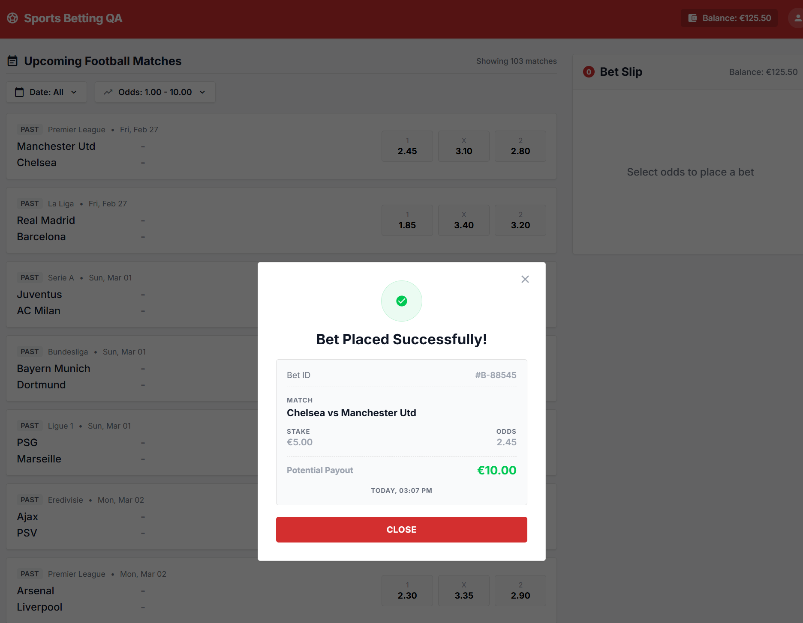
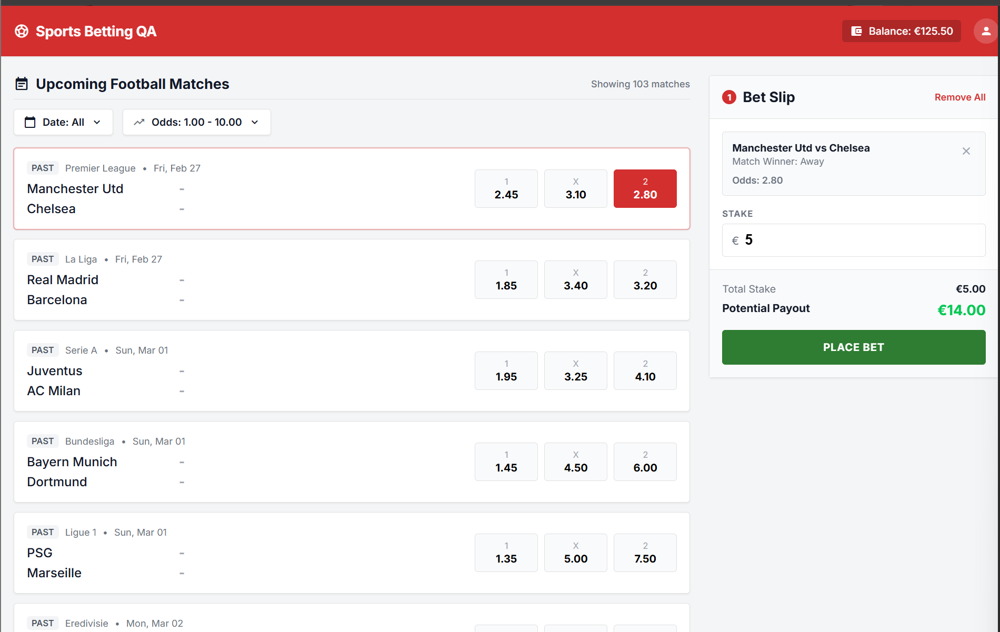
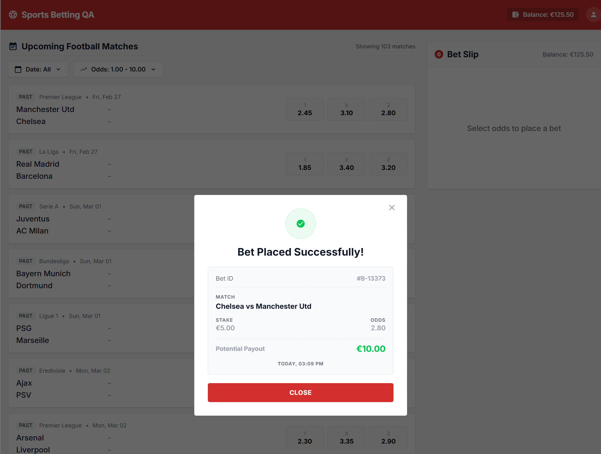
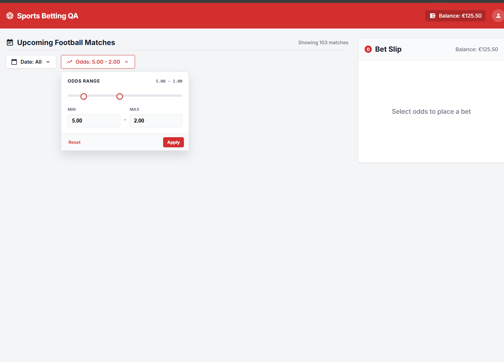
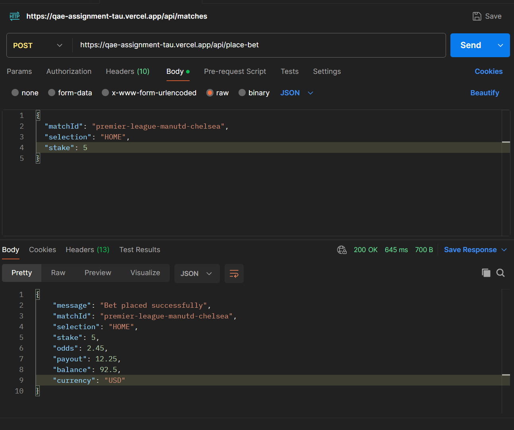

# Execution Results & Bug Report

## Executed Test Scenarios

All test scenarios defined in the test plan were executed manually against the application.

| Test Case ID | Title | Result |
|---|---|---|
| TC-001 | Successful Single Bet Placement | Passed |
| TC-002 | Stake Validation Boundary Testing | Passed |
| TC-003 | Balance Update Consistency After Successful Bet Placement | Failed |
| TC-004 | Potential Payout Calculation and Display Consistency | Failed |
| TC-005 | Date and Odds Filter Validation | Failed |
| TC-006 | Unauthorized API Request Validation | Passed |

---

# BUG-001 — Incorrect potential payout displayed in success receipt modal despite correct backend response

| Field | Details |
|---|---|
| Severity | High |
| Area | Frontend UI / Bet Receipt |
| Preconditions | Valid user-id and available balance |
| Steps to Reproduce | 1. Open the application   2. Select a football match and outcome   3. Enter valid stake amount   4. Verify payout value displayed in the bet slip   5. Place bet successfully   6. Compare payout shown in success receipt modal |
| Expected Result | Success receipt modal displays the same correct payout value previously shown in the bet slip and consistent with backend calculation (`stake × odds`) |
| Actual Result | Backend API returns correct payout value, but the frontend success receipt modal displays incorrect payout information |
| Business Impact | Users may lose trust in the platform due to inconsistent financial information presented after bet placement |
| Evidence |  |

---

# BUG-002 — UI balance is not refreshed after successful bet placement despite backend deduction

| Field | Details |
|---|---|
| Severity | High |
| Area | Frontend UI / Balance Display |
| Preconditions | User has available balance |
| Steps to Reproduce | 1. Record current balance displayed in UI   2. Select valid match and outcome   3. Enter valid stake   4. Place bet successfully   5. Observe displayed balance in UI |
| Expected Result | UI balance is updated immediately after successful placement and reflects deducted stake amount consistently across the UI |
| Actual Result | Backend API correctly deducts balance after successful placement, but frontend UI continues displaying the previous balance value |
| Business Impact | Users may see inconsistent account balance information, creating confusion and reducing confidence in betting account accuracy |
| Evidence | Before placement:     After placement:  |

---

# BUG-003 — Odds filter accepts invalid min/max ranges without validation feedback

| Field | Details |
|---|---|
| Severity | Medium |
| Area | Odds Filter Validation |
| Preconditions | User is on Upcoming Football Matches page |
| Steps to Reproduce | 1. Open Odds filter   2. Enter minimum odds value greater than maximum odds value   3. Apply filter |
| Expected Result | Application rejects invalid range and displays clear validation feedback |
| Actual Result | Application accepts invalid range and returns empty results without validation messaging |
| Business Impact | Users may incorrectly assume no matches are available instead of understanding the filter configuration itself is invalid |
| Evidence |  |

---

# BUG-004 — Backend returns USD instead of EUR in betting API responses

| Field | Details |
|---|---|
| Severity | Medium |
| Area | Backend API / Currency Handling |
| Preconditions | Valid `x-user-id` header and successful bet placement request |
| Steps to Reproduce | 1. Send valid `POST /api/place-bet` request   2. Observe API response payload |
| Expected Result | API response returns `"currency": "EUR"` as defined in the specification |
| Actual Result | API response returns `"currency": "USD"` |
| Business Impact | Currency mismatch may create inconsistencies between frontend and backend systems, potentially impacting integrations, reporting, and financial data interpretation |
| Evidence |  |

---

# Exploratory Testing Notes

## UX Observation — Date Filter Reset Behavior

While testing the date filter functionality, it was observed that using the reset option clears the selected values but keeps the calendar positioned on the previously navigated month instead of returning to the current month.

This behavior is not explicitly contradicted by the specification; however, resetting the calendar view back to the current month could improve usability and reduce navigation effort for users.

---

# API Validation Summary

Additional manual API validation was performed using Postman.

Verified behaviors:
- Missing `x-user-id` correctly returns `401 Unauthorized`
- Unsupported HTTP methods correctly return `405 Method Not Allowed`
- Invalid `matchId` correctly returns `422 Unprocessable Entity`
- Backend correctly calculates payout values
- Backend correctly deducts balance after successful placement

These checks confirmed that several inconsistencies observed in the UI originate from frontend state synchronization and rendering issues rather than backend business logic.